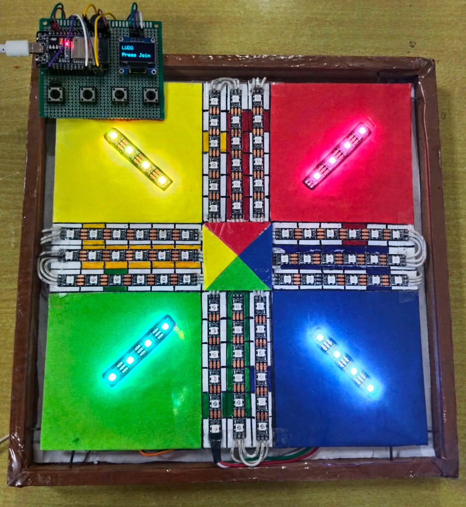

# Luxalea 🎲
### *Lux* (light) + *Alea* (chance)

> A fully wireless digital Ludo board where every dice roll lights up the game. Built on ESP32 with ESP-NOW, WS2812B LEDs, and a custom PCB. No screens, no apps — just hardware, code, and 88 LEDs responding to every move in real time.



---

## Table of Contents
- [Overview](#overview)
- [Demo](#demo)
- [Hardware](#hardware)
- [Wiring](#wiring)
- [Architecture](#architecture)
- [How It Works](#how-it-works)
- [Game Rules](#game-rules)
- [Setup & Flash](#setup--flash)

---

## Overview

Luxalea is a physical Ludo board brought to life with individually addressable LEDs. Two ESP32 boards communicate wirelessly over ESP-NOW — one acts as the **transmitter** (player controller with buttons + OLED display), the other as the **receiver** (game engine + LED board).

Players use physical buttons to roll dice and pick tokens. The board responds instantly — tokens slide across 88 LEDs, kill animations play out, home lanes glow, and the winner's colour flashes across the entire track.

---

## Demo

> 🎬 [Watch Starting Animation](images/starting_animation.mp4)

> 📄 [View_Rulebook (PDF)](rulebook/ludo_rulebook.pdf)

---

## Hardware

| Component | Quantity | Purpose |
|---|---|---|
| ESP32 DevKit | 2 | Transmitter + Receiver |
| WS2812B LED Strip | 1 | Main track (88 LEDs) |
| WS2812B LED Strip | 4 | Base LEDs (4 × 4 = 16 LEDs) |
| SSD1306 OLED (128×64) | 1 | Player display on transmitter |
| Passive Buzzer | 1 | Sound effects |
| Push Buttons | 4 | Player input |
| Custom PCB | 1 | Clean wiring, no breadboard |
| 5V Power Supply | 1 | Powering LEDs |

---

## Wiring

### Transmitter (ESP32 #1)

| Pin | Connected To |
|---|---|
| GPIO 4 | Button 1 (Player 1 — Green) |
| GPIO 5 | Button 2 (Player 2 — Yellow) |
| GPIO 18 | Button 3 (Player 3 — Red) |
| GPIO 19 | Button 4 (Player 4 — Blue) |
| GPIO 21 | OLED SDA |
| GPIO 22 | OLED SCL |
| GPIO 27 | Passive Buzzer |

### Receiver (ESP32 #2)

| Pin | Connected To |
|---|---|
| GPIO 15 | Main LED strip (88 LEDs) |
| GPIO 19 | Base LEDs — Player 1 (Green) |
| GPIO 4 | Base LEDs — Player 2 (Yellow) |
| GPIO 21 | Base LEDs — Player 3 (Red) |
| GPIO 18 | Base LEDs — Player 4 (Blue) |

> ⚡ Power the LED strips directly from 5V (recommended) or from the ESP32 3.3V pin.

---

## Architecture

```
┌─────────────────────────┐          ESP-NOW (WiFi)         ┌─────────────────────────┐
│     TRANSMITTER         │ ──────────────────────────────▶ │      RECEIVER           │
│                         │                                  │                         │
│  4 Buttons              │  GameData { type, player,        │  Game Engine            │
│  SSD1306 OLED           │  dice, token, playerList }       │  88 LED Main Track      │
│  Passive Buzzer         │                                  │  4 × 4 Base LEDs        │
│                         │ ◀────────────────────────────── │                         │
│  Handles:               │  StateMsg { currentPlayer,       │  Handles:               │
│  - Player join/start    │  lastDice, lastToken, event }    │  - Token positions      │
│  - Dice roll + display  │                                  │  - Kill logic           │
│  - Sound effects        │                                  │  - Home lane entry      │
│  - Turn prompts         │                                  │  - Win detection        │
└─────────────────────────┘                                  │  - LED animations       │
                                                             └─────────────────────────┘
```

---

## How It Works

### Position System
Every token's position is stored as **relative steps from its own entry point** (not absolute LED index). This ensures all 4 players travel exactly the same number of steps regardless of where their entry is on the physical track.

- `pos = -1` → token in base
- `pos = 0` → just entered the track (entry square)
- `pos = 0–50` → main track (51 squares)
- `pos = 51–55` → home lane (5 steps, 55 = finished)

### ESP-NOW Communication
Two message types are exchanged:

**Transmitter → Receiver (`GameData`)**
| type | Meaning |
|---|---|
| `0` | Dice roll |
| `1` | Token selection |
| `2` | Game init (player order) |

**Receiver → Transmitter (`StateMsg`)**
| event | Meaning |
|---|---|
| `0` | Normal turn |
| `1` | Kill happened |
| `2` | No moves — skip |
| `3` | Triple 6 — turn lost |
| `4` | Token entered board |
| `5` | Token reached home |
| `6` | Win |
| `7` | Pick a token |

### Token Identification (during your turn)
| Token | Blink |
|---|---|
| Token 1 | Solid — always on |
| Token 2 | Slow (~2× / sec) |
| Token 3 | Medium (~3× / sec) |
| Token 4 | Fast (~7× / sec) |

---

## Game Rules

> 📄 [Full Rulebook (PDF)](rulebook/ludo_rulebook.pdf)

**Quick reference:**
- Roll a **6** to bring a token out of base
- Rolling a **6** earns an extra turn — three 6s in a row cancels your turn
- Land on an opponent's token to **kill** it — they go back to base
- Tokens on **safe spots** cannot be killed
- After a full lap, token **auto-enters** its home lane
- Must reach the last home LED **exactly** — overshooting is invalid
- First to home all **4 tokens** wins 🏆

---

## Setup & Flash

### Requirements
- Arduino IDE with ESP32 board support
- Libraries: `Adafruit NeoPixel`, `Adafruit GFX`, `Adafruit SSD1306`

### Steps

1. Clone the repo
```bash
git clone https://github.com/yourusername/esp32-ludo-board.git
```

2. Open `transmitter/transmitter.ino` in Arduino IDE and update the MAC addresses:
```cpp
uint8_t receiverMAC[]    = {0xXX, 0xXX, 0xXX, 0xXX, 0xXX, 0xXX};
uint8_t transmitterMAC[] = {0xXX, 0xXX, 0xXX, 0xXX, 0xXX, 0xXX};
```

3. Flash `transmitter.ino` to ESP32 #1

4. Open `receiver/receiver.ino` and update the same MAC addresses

5. Flash `receiver.ino` to ESP32 #2

6. Power both boards — the LED strip lights up and OLED shows **LUDO / Press Join**

> 💡 To find your ESP32 MAC address, flash either board and open Serial Monitor at 115200 baud — it prints on startup.

---

*The die is cast. 🎲*
